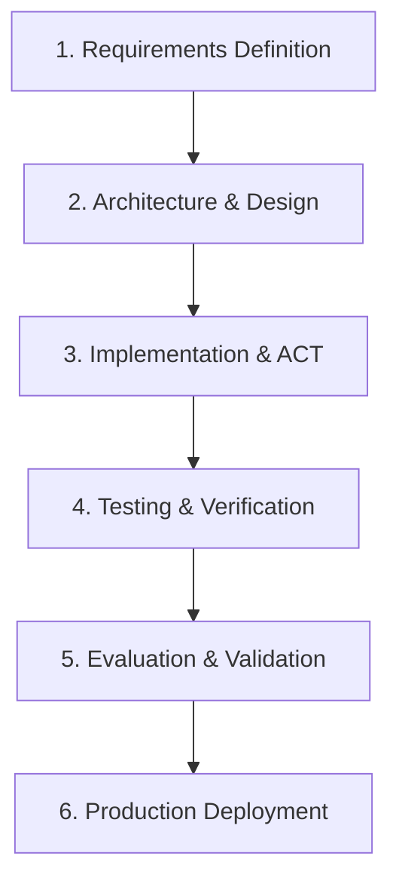

# AI Agent Software Development Life Cycle (SDLC)

This document describes the structured development lifecycle for the Multi-Agent Workforce Intelligence System, aligned with Google's "Agentic Engineering" principles.

---

## 1. Requirements Definition
Identify specific workforce planning tasks:
- Core analytics (retrieval, utilization, forecasting, recommendation).
- Telemetry telemetry constraints.
- Multi-agent orchestration workflows.

## 2. Architecture & Design
Decompose logic into service-oriented tools and specialized agents:
- Base class abstractions (`BaseAgent`, `BaseTool`).
- Shared state patterns passed between stages.
- Intent classification and dynamic routing routing tables.

## 3. Implementation & ACT
Write clean, standard-compliant python code:
- Implementation of specialized agents.
- Harness-based helper utilities (Prompt Loader, Registries, Memory Manager).
- Implement execution loops: **PLAN -> ACT -> OBSERVE -> VALIDATE -> REFINE -> REPORT -> MEMORY UPDATE**.

## 4. Testing & Verification
Establish unit and integration test harnesses:
- Verify mock runs, state propagation, and routing logic.
- Expand tests to match all telemetry, explainability, retry, and validation rules.

## 5. Evaluation & Validation
Monitor and validate agent outputs:
- Perform orchestration validation (section checks, confidence thresholds, tool status).
- Calculate overall execution quality score (`Excellent`, `Good`, `Needs Review`).
- Stream logs directly into Streamlit visual traces.

## 6. Production Deployment
Deploy final streamlit dashboard to staging/production:
- Expose orchestration logs.
- Interactive user query execution.
