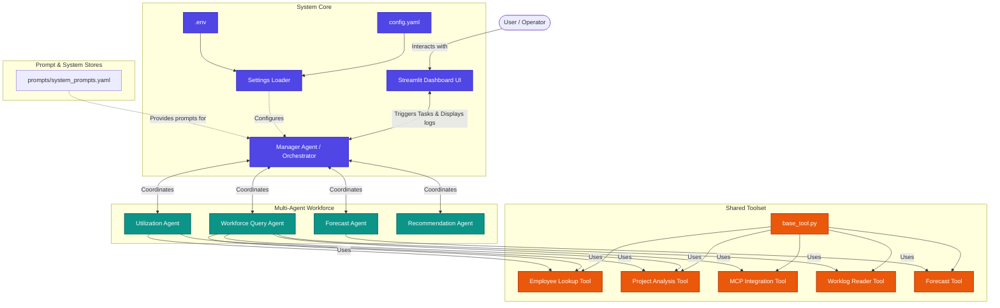

# AI-Workforce-Intelligence-Agent

An advanced Multi-Agent Workforce Intelligence System designed to help managers analyze employee productivity, utilization, forecasting, and workforce planning. The system automates workforce analysis, processes local workforce datasets, and synthesizes them into actionable reports through an interactive Streamlit dashboard.

---

## 🏗️ System Architecture

The following diagram illustrates the relationship between the user interface, the system configuration, the agent orchestrator, and the specialized agents and tools.



---

## 📁 Directory Structure

```text
AI-Workforce-Intelligence-Agent/
├── .env.example             # Template for local environment variables
├── .gitignore               # Files and directories excluded from git
├── README.md                # Project documentation and system architecture
├── requirements.txt         # Project dependencies
├── app.py                   # Main Streamlit dashboard application
├── architecture/            # Architecture documentation and models
│   └── README.md
├── config/                  # Configuration loaders and files
│   ├── __init__.py
│   ├── config.yaml          # System YAML configuration
│   └── settings.py          # Python settings management
├── prompts/                 # Agent system prompts and template store
│   ├── system_prompts.yaml
│   └── utilization_agent_prompt.yaml
├── agents/                  # Multi-agent implementations
│   ├── __init__.py
│   ├── base_agent.py        # Abstract base agent class
│   ├── llm_client.py        # Unified Gemini and OpenAI client wrapper
│   ├── workforce_query_agent.py # Data retrieval and routing agent
│   └── utilization_agent.py # Workload and productivity agent
└── tools/                   # Extensible agent tools
    ├── __init__.py
    ├── base_tool.py         # Abstract base tool class
    ├── employee_lookup.py   # Employee profile lookup tool
    ├── project_analysis.py  # Project allocations analysis tool
    ├── mcp_integration.py   # MCP data source connectors
    └── worklog_reader.py    # Local dataset reader
```

---

## 🚀 Setup & Getting Started

### 1. Prerequisites
- **Python**: Version `3.10` or higher is recommended.
- **Git**

### 2. Clone and Initialize
Clone the repository and install the dependencies:
```bash
# Clone the repository (if applicable)
# git clone <repository-url>
# cd AI-Workforce-Intelligence-Agent

# Set up a virtual environment
python -m venv venv
venv\Scripts\activate      # On Windows
# source venv/bin/activate  # On macOS/Linux

# Install dependencies
pip install -r requirements.txt
```

### 3. Environment Setup
Copy the example environment configuration file to `.env` and fill in your keys:
```bash
cp .env.example .env
```

### 4. Run the Streamlit Dashboard
Launch the dashboard to monitor agent execution:
```bash
streamlit run app.py
```

---

## ⚙️ Core Configuration
System parameters, default agent persona models, and tool paths are governed by `config/config.yaml`.
Modify the YAML configuration directly to alter LLM temperature parameters, change agents, or tweak performance settings.
