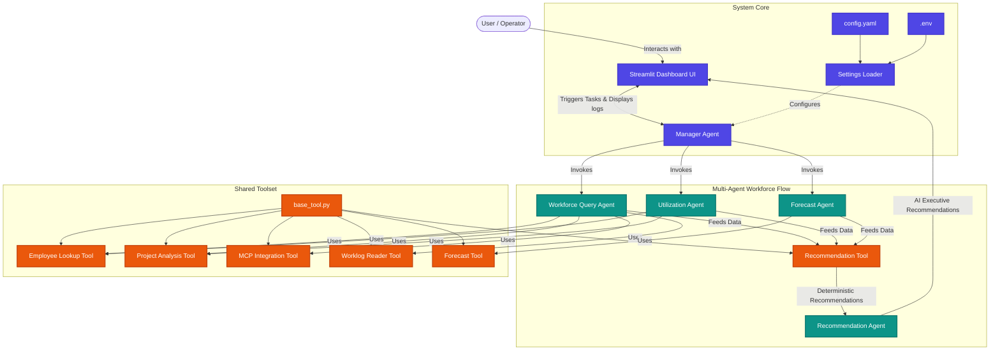

# AI Workforce Intelligence Platform

<div align="center">

[]()
[]()
[]()
[]()
[]()
[]()
[]()

**A multi-agent AI system that analyzes workforce data, detects utilization risks, forecasts capacity, and generates strategic recommendations — all through an interactive Streamlit dashboard.**

[Jump to Business Impact](#business-impact) •
[Jump to Why Agentic AI?](#why-agentic-ai) •
[Jump to Architecture](#system-architecture) •
[Jump to Quick Start](#quick-start) •
[Jump to Judge Q&A](JUDGE-QA.md)

</div>

---

## Business Impact

Modern workforce management faces three critical challenges:

| Challenge | Impact | How This System Helps |
|---|---|---|
| **Hidden overutilization** | Burnout, attrition, productivity loss | Automatically detects employees exceeding 90% utilization thresholds |
| **Capacity blind spots** | Missed deadlines, over-hiring | Forecasts workload 2-3 months ahead with data-backed projections |
| **Reactive decisions** | Costly last-minute rebalancing | Generates prioritized strategic recommendations with evidence traceability |

**Without this system:** managers manually comb through spreadsheets, miss early warning signs, and make gut-feel decisions.

**With this system:** a manager types "Show me utilization risks in Engineering" and receives a structured executive report with evidence, confidence scoring, and action items — in under 10 seconds.

---

## Why Agentic AI?

A **single LLM call** (e.g. "analyze this CSV and tell me what's wrong") suffers from:

- **Hallucination** — the model fabricates numbers, metrics, or citations not in the data
- **No tool access** — it can't query databases, validate its own outputs, or fetch external context
- **No memory** — each query starts from scratch with no awareness of prior analysis
- **No validation** — if it outputs a wrong calculation, there's no mechanism to catch it

**Agentic AI** solves these by replacing a single LLM call with a structured **lifecycle**:

```
PLAN -> ACT -> OBSERVE -> VALIDATE -> REFINE -> REPORT -> MEMORY UPDATE
```

Each phase is executed by a specialized sub-agent with its own tools, validation rules, and error recovery. The result: **deterministic data access, self-correcting outputs, and auditable reasoning.**

This system implements the full Google Agentic Engineering pattern — not as a chatbot wrapper, but as a proper multi-agent orchestration loop (see [ManagerAgent](agents/manager_agent.py):604).

---

## System Architecture

The following diagram illustrates the relationship between the user interface, the system configuration, the agent orchestrator, and the specialized agents and tools.



### Multi-Agent Orchestration

The system is built around a **Manager Agent** that implements the complete AI lifecycle. Unlike single-LLM apps that route prompts to one model, this system uses 4 specialized sub-agents orchestrated through a shared state:

| Agent | Responsibility | Tools Used | Triggered By |
|---|---|---|---|
| **WorkforceQueryAgent** | Intent classification, entity extraction, tool routing | EmployeeLookup, ProjectAnalysis, MCP, WorklogReader | Every query (PLAN phase) |
| **UtilizationAgent** | Compute utilization %, detect overloaded/underutilized, identify risks | EmployeeLookup, ProjectAnalysis | `utilization_analysis` intent |
| **ForecastAgent** | Capacity trend analysis, hiring forecasts, gap detection | ForecastTool | `forecast_analysis` intent |
| **RecommendationAgent** | Synthesize all outputs into prioritized actions | RecommendationTool | After data-gathering agents |

### What Makes This Different From a Single LLM App

| Aspect | Single LLM App | This Agentic System |
|---|---|---|
| **Data access** | Prompt-injected (hallucinates) | Tools query real CSVs deterministically |
| **Error recovery** | Returns error or hallucinates | Retries up to 3x per agent, graceful degradation |
| **Validation** | None | 8-point validation per report, confidence scoring |
| **Memory** | Stateless | Session memory across turns |
| **Auditability** | Black box | Full execution trace, evidence lineage |
| **MCP support** | None | Filesystem, Drive, Notion connectors |
| **LLM dependency** | Required always | Graceful mock fallback without API keys |

### Key Design Decisions

1. **Deterministic tool layer** — all data queries go through tools, not LLM. The LLM only synthesizes, never retrieves.
2. **Shared state** — all agents read/write a single `state` dict. No inter-agent message passing, no deadlocks.
3. **Retry with backoff** — each sub-agent gets 3 attempts before graceful degradation.
4. **Mock mode** — zero API keys required. Deterministic mock responses let judges evaluate the full pipeline.
5. **Unified thresholds** — `overloaded_threshold` (90%) and `underutilized_threshold` (50%) live in `config/settings.py`.

---

## Datasets

Six synthetic datasets (15 employees, 5 departments, 2 months of data):

| Dataset | Rows | Key Columns |
|---|---|---|
| `employees.csv` | 15 | employee_id, department, role, salary_band, status |
| `project_allocations.csv` | 27 | employee_id, project_id, allocation_percentage |
| `worklogs.csv` | 498 | employee_id, date, hours_logged, task_category |
| `attendance.csv` | ~450 | employee_id, date, status (Present/PTO/Sick/Leave) |
| `capacity.csv` | ~30 | employee_id, month, total_capacity_hours |

All data is **deterministically generated** (seed=42) for reproducibility. Judges see the same data every run.

---

## Quick Start

### Without API Keys (Recommended for Judges)

```bash
setup.bat
```

This installs dependencies, generates datasets, and launches the app. The system runs in **mock mode** with a clear banner — all agents, tools, and reports function exactly as they would with a real LLM.

### With API Keys

```bash
copy .env.example .env
# Edit .env: add GEMINI_API_KEY or OPENAI_API_KEY
setup.bat
```

### Manual Setup

```bash
python -m venv venv
venv\Scripts\activate
pip install -r requirements.txt
python -m data_layer.run_pipeline
streamlit run app.py
```

---

## Demo

[Video demo](https://youtu.be/YOUR_VIDEO_ID) showing:

1. Launching the app with `setup.bat`
2. Querying employees by department and salary band
3. Running utilization analysis with risk detection
4. Generating a 2-month capacity forecast
5. Requesting strategic recommendations with evidence traceability
6. Error handling — querying a non-existent employee

---

## Key Concepts (Kaggle Rubric)

| Concept | Implementation |
|---|---|
| **Multi-Agent System** | 4 specialized agents orchestrated by ManagerAgent with lifecycle loop |
| **MCP (Model Context Protocol)** | Filesystem, Google Drive, and Notion connectors with path traversal security |
| **Deployability** | One-click `setup.bat`, Streamlit Cloud deployment, mock mode requires zero API keys |
| **Security** | Path traversal protection on MCP filesystem, `.env`-based secrets, `__pycache__` isolation |
| **Evaluation & Quality** | 12-metric scorecard, per-query validation, regression testing, confidence scoring |

---

## Project Structure

```text
AI-Workforce-Intelligence-Agent/
├── .env.example             # Template for environment variables
├── README.md                # This file
├── JUDGE-QA.md              # Prepared judge Q&A
├── requirements.txt         # Dependencies
├── setup.bat                # One-click setup for judges
├── app.py                   # Streamlit dashboard (UI)
│
├── agents/                  # Multi-agent system
│   ├── manager_agent.py     # Orchestrator (PLAN->ACT->OBSERVE->VALIDATE->REFINE->REPORT->MEMORY)
│   ├── workforce_query_agent.py  # Intent + entity extraction
│   ├── utilization_agent.py # Workload and productivity analysis
│   ├── forecast_agent.py    # Capacity forecasting
│   └── recommendation_agent.py # Strategic recommendations
│
├── tools/                   # Deterministic tool layer
│   ├── employee_lookup.py   # CSV data access and filtering
│   ├── forecast_tool.py     # Forecast computation
│   ├── mcp_integration.py   # MCP connectors (FS/Drive/Notion)
│   └── worklog_reader.py    # Dataset reader
│
├── config/                  # Configuration
│   ├── settings.py          # Singleton: API keys, thresholds, paths
│   └── config.yaml          # YAML overrides
│
├── data_layer/              # Data pipeline
│   ├── generator.py         # Synthetic data generation (seed=42)
│   ├── cleaner.py           # Data cleaning + standardization
│   ├── validator.py         # Schema + integrity validation
│   └── run_pipeline.py      # End-to-end pipeline
│
├── evaluation/              # Benchmark + quality
│   ├── evaluation_runner.py # 12-metric benchmark suite
│   ├── quality_score.py     # Weighted quality calculation
│   └── response_validator.py # 8-point response validation
│
├── reporting/               # Intelligent Report Engine
│   ├── report_router.py     # Routes state to correct builder
│   ├── report_builder.py    # Base builder with shared utilities
│   ├── narrative_generator.py # LLM-powered prose generation
│   └── report_validator.py  # 9-point report validation
│
├── prompts/                 # YAML prompt templates
├── datasets/                # Generated CSVs (employees, worklogs, etc.)
├── tests/                   # Unit tests
└── context/                 # Context management system
```
