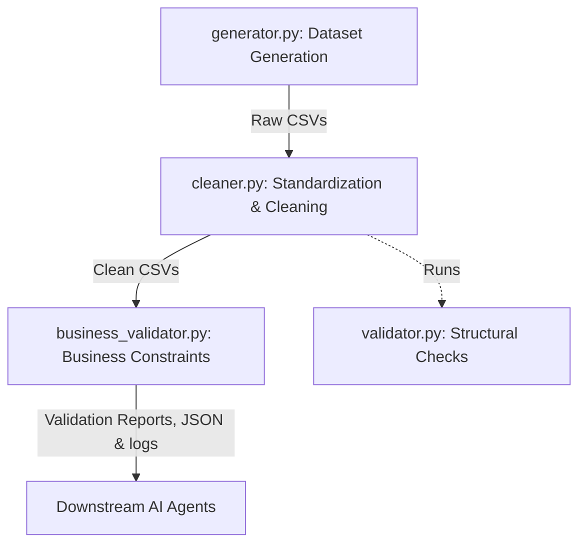

# AI Workforce Intelligence Agent - Data Pipeline Documentation

This document explains the architecture, flow, and components of the data preprocessing, cleaning, and validation pipeline.

---

## Data Pipeline Architecture

The pipeline consists of three sequential phases that transform raw inputs into validated, analysis-ready datasets.



### Phase 1: Dataset Generation (`data_layer/generator.py`)
Generates realistic, internally consistent synthetic datasets for simulation and modeling.
- Outputs files to `datasets/` directory:
  - `employees.csv`
  - `worklogs.csv`
  - `project_allocations.csv`
  - `attendance.csv`
  - `capacity.csv`

### Phase 2: Data Cleaning & Preparation (`data_layer/cleaner.py`)
Standardizes text representations, cleans date issues, handles missing values, and establishes referential integrity.
- **Key Operations**:
  - Imputes numerical missing values using a median strategy and categorical missing values using a mode strategy.
  - Standardizes project names (handling acronym capitalization like HR, V2).
  - Automatically classifies projects into categories (`Development`, `Support`, `Analytics`, `Infrastructure`, `Research`, `Operations`).
  - Drops duplicate rows.
  - Validates and coerces all date formats to standard ISO strings (`YYYY-MM-DD`).
  - Enforces strict foreign key referential integrity (cascades removal of records referencing non-existent employee/project IDs).
  - Automatically exports clean datasets to `datasets/clean/`.
  - Runs structural validation checks using the `WorkforceDataValidator` from `data_layer/validator.py`.
  - Automatically generates the updated [data_dictionary.md](../datasets/data_dictionary.md).

### Phase 3: Business Validation Layer (`data_layer/business_validator.py`)
Performs domain-level validation to identify business logic anomalies and extract workforce intelligence insights.
- **Rules Evaluated**:
  - **Employee rules**: ID uniqueness, non-blank names, valid department and manager constraints, no duplicates.
  - **Attendance rules**: Employee ID existence, no future dates, check-in time < check-out time order, no duplicates on `(employee_id, date)`.
  - **Worklog rules**: Employee & project reference consistency, non-negative logged hours, daily limit verification, duplicate logging detection.
  - **Capacity rules**: Active employee records check, available hours limit check, negative value checks.
  - **Project allocation rules**: Valid references, allocation boundaries (0-100%), non-null project categories, duplicate allocation flags.
  - **Workforce Intelligence rules**: Utilization rate computation, overloaded (>90%) and underutilized (<30%) flags, benched staff (0% allocations), project resource assignment check, project over-capacity log.
- **Outputs**:
  - Structured execution status (`PASS` / `FAIL`) along with lists of errors, warnings, and insights.
  - Generates Markdown reports in `reports/business_validation_report.md`.
  - Appends detailed structured logs in `logs/business_validation.log`.
  - Exports a structured JSON representation for agent consumption at `reports/business_validation_results.json`.

---

## Execution Command
To run the entire orchestrated pipeline:
```bash
python -m data_layer.run_pipeline
```
To execute only the business validation phase on pre-existing clean datasets:
```bash
python -m data_layer.business_validator
```
