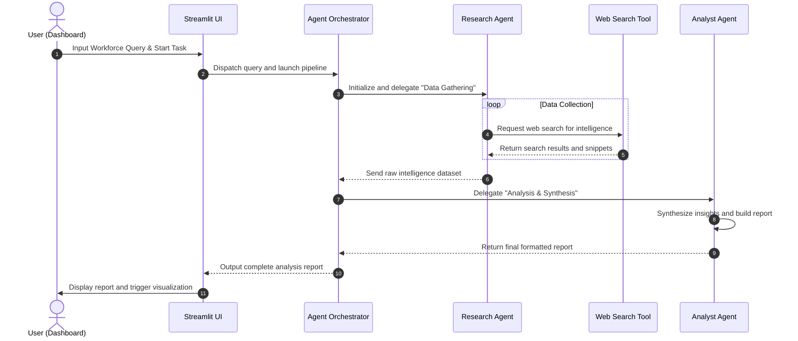

# System Architecture & Design

This directory contains the design blueprints and technical details of the **AI-Workforce-Intelligence-Agent**.

## Core System Components

---

## Component Details

### 1. User Interface (`app.py`)
Provides an interactive experience for operators. Built with Streamlit, it offers real-time pipeline monitoring, chat capabilities with agents, and structured markdown report downloads.

### 2. Agent Orchestrator
Coordinates instructions and intermediate data flow. It handles step-by-step logic, passing the raw output from the `ResearchAgent` to the `AnalystAgent`.

### 3. Research Agent (`agents/research_agent.py`)
Specializes in search queries, extracting relevant data points, and verifying sources. Equipped with the `WebSearchTool`, it scans web domains and collects raw data.

### 4. Analyst Agent (`agents/analyst_agent.py`)
Consolidates the research data, performs trend analysis, identifies key insights, and structures them into a comprehensive workforce report.

### 5. Web Search Tool (`tools/web_search.py`)
An abstraction over third-party APIs (such as Tavily, Google Search, or custom crawlers) that standardizes the response format for consumption by the research agent.
