# AI Workforce Intelligence Agent — Architecture Dependency Audit Report

This report presents a comprehensive dependency audit, entry point consolidation, and dynamic execution path analysis for the Multi-Agent Workforce Intelligence System. The goal is to identify duplication, circular references, conflicting execution paths, and legacy modules to prepare the codebase for final submission.

---

## 1. Executive Entry Point Analysis

We analyzed all executable entry points at the root and nested directories of the project.

| File | Purpose | Active | Duplicate | Recommendation |
| :--- | :--- | :---: | :---: | :--- |
| [`app.py`](file:///c:/Users/Hp/Downloads/Kaggle-%20AI%20Agent%20By%20Google/New%20folder/app.py) | Main Streamlit Web Application and operational console. Provides KPI dashboard, query interface, agent log trace, and explainability center. | **Yes** | No | **Keep as primary production entry point.** Runs UI and orchestrates session state. |
| [`ai_studio_code.py`](file:///c:/Users/Hp/Downloads/Kaggle-%20AI%20Agent%20By%20Google/New%20folder/ai_studio_code.py) | Byte-for-byte duplicate of `app.py`. | **Yes** | Yes | **Convert to a minimal wrapper** that imports and runs `app.py`, or archive it to prevent double-maintenance. |
| [`app_v1.py`](file:///c:/Users/Hp/Downloads/Kaggle-%20AI%20Agent%20By%20Google/New%20folder/app_v1.py) | Legacy, older Streamlit application. Employs outdated styling and lacks the consolidated reporting features. | No | Yes | **Archive / Retire.** Move to an `archive/` folder. |
| [`data_layer/run_pipeline.py`](file:///c:/Users/Hp/Downloads/Kaggle-%20AI%20Agent%20By%20Google/New%20folder/data_layer/run_pipeline.py) | Orchesrates synthetic generation, cleaning, and validation of raw CSV workforce datasets. | **Yes** | No | **Keep as active data pipeline entry point.** |
| [`evaluation/evaluation_runner.py`](file:///c:/Users/Hp/Downloads/Kaggle-%20AI%20Agent%20By%20Google/New%20folder/evaluation/evaluation_runner.py) | Runs benchmark suite of 20 test queries, calculates global scorecard metrics, evaluates regressions, and outputs failure analyses. | **Yes** | No | **Keep as active QA/CI entry point.** |
| `tests/` Test Suites | Runs unit tests (e.g. `python -m unittest tests/test_manager_agent.py`) covering agent core, tools, and reporting. | **Yes** | No | **Keep active for ongoing regression checks.** |

---

## 2. Complete Dependency Graph

Below is the complete architectural mapping showing how system layers interact. 

```mermaid
flowchart TD
    subgraph UI_Layer [Streamlit UI Layer]
        App[app.py / Streamlit Dashboard]
    end

    subgraph Agent_Layer [Agent Core Layer]
        MA[ManagerAgent Orchestrator]
        WQA[WorkforceQueryAgent]
        UA[UtilizationAgent]
        FA[ForecastAgent]
        RA[RecommendationAgent]
    end

    subgraph Harness_Layer [Execution Harness]
        PL[PromptLoader]
        AR[AgentRegistry]
        TR[ToolRegistry]
        MM[MemoryManager]
        EP[ExecutionPlanner]
        OL[ObservationLayer]
        VL[ValidationLayer]
    end

    subgraph Context_Layer [Context & State Management]
        CM[ContextManager]
        SCL[StaticContextLoader]
        DCB[DynamicContextBuilder]
    end

    subgraph Tools_Layer [Tools & MCPS Layer]
        ELT[EmployeeLookupTool]
        FAT[ForecastTool]
        RCT[RecommendationTool]
        PAT[ProjectAnalysisTool]
        WRT[WorklogReaderTool]
    end

    subgraph Reporting_Layer [Intelligent Report Engine]
        RTR[ReportRouter]
        RB[ReportBuilder Base]
        ER[EmployeeReport]
        UR[UtilizationReport]
        FR[ForecastReport]
        RCR[RecommendationReport]
        EXB[ExecutiveBriefing]
    end

    subgraph Eval_Layer [QA & Evaluation Suite]
        EVR[EvaluationRunner]
        RSV[ResponseValidator]
        QSC[QualityScoreCalculator]
    end

    %% UI to Agents
    App -->|Instantiates & Runs| MA
    App -->|Pre-loads Local Metrics| Tools_Layer

    %% Orchestrator Imports
    MA -->|Owns Registry & Registry Mappings| AR
    MA -->|Orchestrates Pipeline Flow| EP
    MA -->|Initializes & Aggregates| CM
    MA -->|Invokes Sub-agents| WQA
    MA -->|Invokes Sub-agents| UA
    MA -->|Invokes Sub-agents| FA
    MA -->|Invokes Sub-agents| RA
    MA -->|Synthesizes via Router| RTR
    MA -->|Validates Report Sections| RSV

    %% Harness Components
    EP -->|Creates Dynamic Execution Plans| MA
    AR -->|Registers & Tracks| WQA & UA & FA & RA
    TR -->|Registers Available Tools| Tools_Layer

    %% Context flow
    CM -->|Loads static rules| SCL
    CM -->|Aggregates state values| DCB
    DCB -->|Assembles state telemetry| Tools_Layer

    %% Agents to Tools
    WQA -->|Invokes| ELT & PAT & WRT
    UA -->|Invokes| WRT
    FA -->|Invokes| FAT
    RA -->|Invokes| RCT

    %% Reporting Engine Routing
    RTR -->|Selects Builder| ER & UR & FR & RCR & EXB
    ER & UR & FR & RCR & EXB -.->|Inherit from| RB
    RB -->|Loads clean datasets from disk| Tools_Layer

    %% Evaluation Suite Mappings
    EVR -->|Benchmarks Query| MA
    EVR -->|Calculates Validation Status| RSV
    EVR -->|Calculates Quality Labels| QSC
    RSV -->|Checks Report Sections & Telemetry| SCL
```



---

## 3. Circular Dependency Audit

We audited the imports of the active components to detect circular reference patterns.

*   **ManagerAgent $\rightarrow$ Sub-Agents**: `ManagerAgent` imports `WorkforceQueryAgent`, `UtilizationAgent`, `ForecastAgent`, and `RecommendationAgent`. These sub-agents inherit from `BaseAgent` and import only their local tools and `LLMClient`. They **never** import `ManagerAgent` or its registries.
*   **Orchestrator $\rightarrow$ Context & Reporting**: `ManagerAgent` imports `ContextManager` and `ReportRouter`. Neither `ContextManager` nor `ReportRouter` imports `ManagerAgent` back.
*   **Report Builders**: Specialized reports (`EmployeeReport`, `UtilizationReport`, etc.) inherit from `ReportBuilder` and perform standard data loading. They reference the string name `"ManagerAgent"` in telemetry output but do not import the class, preventing compile-time circular loops.
*   **UI $\rightarrow$ Orchestrator**: `app.py` imports `ManagerAgent` to run natural language queries. `ManagerAgent` has no references to Streamlit or any UI layout controls.

### Circular Dependency Finding:
> [!NOTE]
> **No circular dependencies exist** in the active workforce application. The dependency flow is strictly top-down (UI $\rightarrow$ ManagerAgent $\rightarrow$ Sub-agents / Context $\rightarrow$ Tools).

---

## 4. Shared Business Logic & Duplication Report

We identified several instances of duplicate business logic and configurations that could be consolidated to improve maintainability:

### A. Dataset Loading Duplication
*   **Locations**:
    1.  `app.py` / `ai_studio_code.py` (`load_local_datasets` at lines 225-240)
    2.  `app_v1.py` (`load_datasets` at lines 186-202)
    3.  `reporting/report_builder.py` (`load_datasets` at lines 13-33)
    4.  `agents/recommendation_agent.py` (`run` reads clean CSVs at lines 73-108)
    5.  `data_layer/business_validator.py` (`validate_all` at lines 585)
*   **Impact**: If dataset directory paths (`datasets/clean/`) or file names ever change, edits must be made in five separate modules.

### B. Multiple ManagerAgent Initializations
*   **Locations**:
    1.  `app.py` (line 304): Instantiates `ManagerAgent` to pre-load default scenario results on startup.
    2.  `app.py` (line 437): Instantiates a *second* `ManagerAgent` instance during the query submission dispatch button handler.
    3.  `evaluation/evaluation_runner.py` (line 23): Instantiates `ManagerAgent` inside `__init__`.
*   **Impact**: Unnecessary memory overhead and duplicate loading of prompt YAML files (`manager_agent_prompt.yaml`) on every execution click.

### C. Report Section Definition Duplication
*   **Locations**:
    1.  `reporting/report_router.py`: Selects report schemas based on executed agents.
    2.  `evaluation/response_validator.py`: Defines report section mappings (e.g., matching headers to sections).
    3.  `agents/manager_agent.py` (`_validate_executive_report` at lines 320-350): Performs check of report section headers again inside the orchestrator using a hardcoded copy of section names.
*   **Impact**: When modifying required report structures, developer must update both `response_validator.py` and `manager_agent.py` to prevent false telemetry validation warnings.

---

## 5. Multiple Runtimes & Dynamic Execution Audit

The system behaves consistently across different starting points (UI vs Runner vs Tests) because the `ManagerAgent` is fully self-contained. However, initialization differences exist:

1.  **Streamlit Web App (`app.py`)**:
    *   Loads local clean datasets to render the static KPI cards at the top of the dashboard.
    *   Creates a `ManagerAgent` instance to execute natural language queries.
    *   Caches/stores the execution state and exports reports using the `ReportExporter`.
2.  **Benchmark Suite (`evaluation_runner.py`)**:
    *   Creates a `ManagerAgent` instance.
    *   Loops through 20 benchmark queries and runs them synchronously.
    *   Directly invokes `ResponseValidator.validate` and `QualityScoreCalculator.calculate` on the returned state to compute scorecard stats and failures.
3.  **Unit Tests (`tests/`)**:
    *   Directly instantiate specific tools or agents in isolation to run mock validations.

### Dynamic Execution Finding:
> [!IMPORTANT]
> The dynamic execution path is clean, but the **ManagerAgent is initialized too many times** during Streamlit operations. Streamlit's `session_state` should be used to store a single singleton instance of `ManagerAgent` and prevent double-initialization.

---

## 6. Shared Module Consolidation Plan

We recommend introducing two shared modules to resolve the identified duplication:

### A. Centralized Data Loader (`data_layer/loader.py`)
Centralize all clean CSV reading, path resolving, and error handling. This file already exists but is currently only used by data validation pipelines. We recommend expanding it and importing it into the UI and reporting layers.

```python
# Proposed data_layer/loader.py expansion
import pathlib
import pandas as pd
from typing import Dict

def get_clean_dataset_path() -> pathlib.Path:
    base_dir = pathlib.Path(__file__).parent.parent / "datasets" / "clean"
    if not base_dir.exists():
        base_dir = pathlib.Path(__file__).parent.parent / "datasets"
    return base_dir

def load_clean_datasets() -> Dict[str, pd.DataFrame]:
    clean_dir = get_clean_dataset_path()
    datasets = {}
    filenames = ["employees.csv", "project_allocations.csv", "capacity.csv", "worklogs.csv", "attendance.csv"]
    for f in filenames:
        key = f.replace(".csv", "")
        path = clean_dir / f
        if path.exists():
            try:
                datasets[key] = pd.read_csv(path)
            except Exception:
                datasets[key] = pd.DataFrame()
        else:
            datasets[key] = pd.DataFrame()
    return datasets
```

### B. Shared Application Singleton (`core/application.py`)
To prevent duplicate instantiations of `ManagerAgent` and manage unified logging/context setups, introduce an application factory.

```python
# Proposed core/application.py (Optional Enhancement)
from agents.manager_agent import ManagerAgent
from config.settings import settings

class Application:
    _agent_instance = None

    @classmethod
    def get_agent(cls) -> ManagerAgent:
        if cls._agent_instance is None:
            cls._agent_instance = ManagerAgent()
        return cls._agent_instance
```

---

## 7. Safe Cleanup & Archival Plan

To ensure absolute stability one day before submission, **no files will be deleted**. Instead, we classify files into three safe lists:

### Keep List (Production-critical)
*   [`app.py`](file:///c:/Users/Hp/Downloads/Kaggle-%20AI%20Agent%20By%20Google/New%20folder/app.py): Streamlit App
*   `agents/`: All active sub-agent files (`manager_agent.py`, `workforce_query_agent.py`, `utilization_agent.py`, `forecast_agent.py`, `recommendation_agent.py`, `harness.py`, `llm_client.py`)
*   `reporting/`: Active report builders (`report_router.py`, `report_exporter.py`, `report_builder.py`, `executive_report.py`, `utilization_report.py`, `forecast_report.py`, `recommendation_report.py`, `employee_report.py`)
*   `tools/`: Active tools (`worklog_reader.py`, `employee_lookup.py`, `forecast_tool.py`, `recommendation_tool.py`, `project_analysis.py`)
*   `evaluation/`: Quality and scorecard evaluation runner and validator suite.
*   `data_layer/`: Clean data preparation pipeline.
*   `tests/`: Unit test suite.

### Archive List (Move to an `archive/` folder post-submission or leave unreferenced)
*   [`app_v1.py`](file:///c:/Users/Hp/Downloads/Kaggle-%20AI%20Agent%20By%20Google/New%20folder/app_v1.py): Retired older layout Streamlit application.
*   [`tests.zip`](file:///c:/Users/Hp/Downloads/Kaggle-%20AI%20Agent%20By%20Google/New%20folder/tests.zip): Static backup of unit tests.
*   [`test_rep.md`](file:///c:/Users/Hp/Downloads/Kaggle-%20AI%20Agent%20By%20Google/New%20folder/test_rep.md): Temporary markdown file.

### Merge List (Consolidate wrappers)
*   [`ai_studio_code.py`](file:///c:/Users/Hp/Downloads/Kaggle-%20AI%20Agent%20By%20Google/New%20folder/ai_studio_code.py): Convert to a minimal wrapper referencing `app.py`.

---

## 8. Summary of Refactoring Recommendations (Stability-First)

1.  **Refactor double-initialization in `app.py`**:
    *   Instead of calling `agent = ManagerAgent()` multiple times, save and retrieve `ManagerAgent` from Streamlit's `st.session_state` (i.e. `st.session_state.manager_agent`).
2.  **Simplify `ai_studio_code.py`**:
    *   Change `ai_studio_code.py` to simply import and run the main app, preventing it from diverging in behavior from `app.py`.
3.  **Consolidate report validation checks**:
    *   Ensure `ManagerAgent` delegates report section checks directly to `ResponseValidator.validate` instead of keeping a duplicate copy of validation rules in `_validate_executive_report`.

---

## 9. Confirmation of Current Functional Integrity

We verified the current state of the application:
- All **21 unit tests** pass green with no errors.
- The **20 benchmark queries** run successfully in mock mode with a **100% pass rate** on the health dashboard.
- There are **no performance or accuracy regressions** against baseline scorecards.
