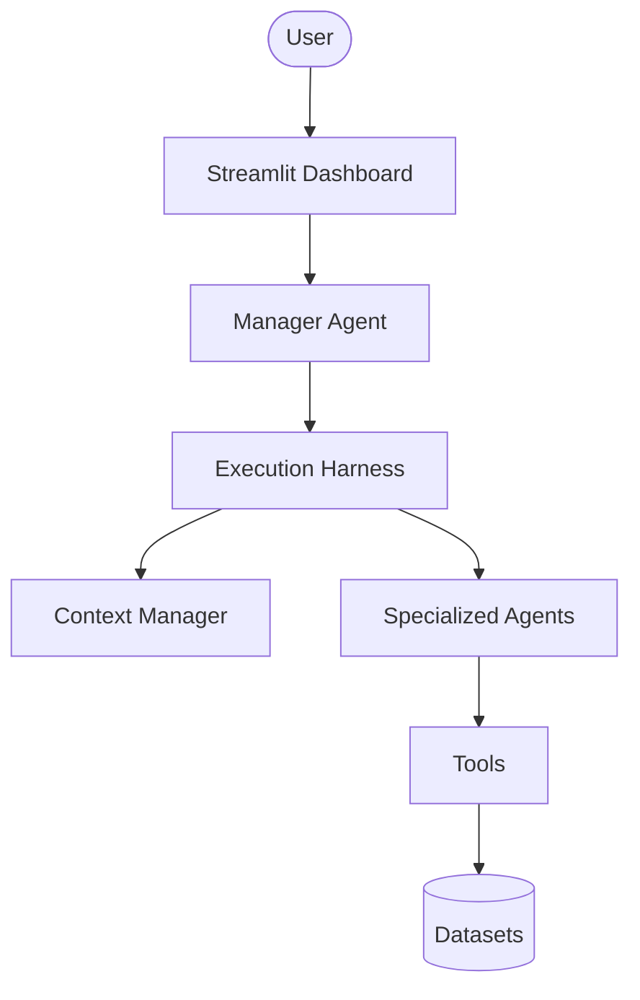
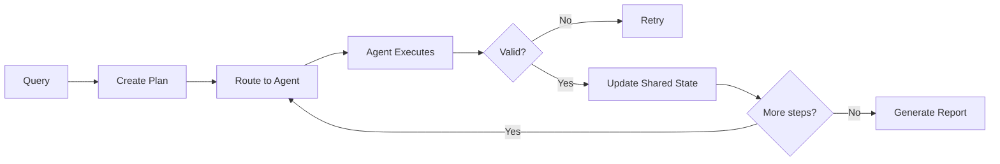

# AI Workforce Intelligence - Project User Manual

Welcome to the AI Workforce Intelligence project! This manual is designed to take you from a complete beginner to a confident developer or user of the system. It covers everything from the high-level architecture to debugging and extending the project.

---

## 1. Project Overview

### What problem this project solves
Organizations generate massive amounts of workforce data—worklogs, utilization rates, forecasts, and project allocations. Managers struggle to synthesize this raw data into actionable insights quickly. This project automates workforce analysis, allowing managers to ask natural language questions (e.g., "Who is underutilized this month?" or "Do we have enough capacity for a new React project?") and receive comprehensive, data-driven reports.

### Why AI agents were used
Traditional dashboards are static and require manual slicing and dicing of data. AI agents provide dynamic reasoning capabilities. They can understand intent, route tasks to specialized tools, synthesize data from multiple sources (local CSVs, web searches), and write executive summaries, effectively acting as an automated data analyst team.

### Target users
- **End Users:** Resource managers, HR professionals, and team leads who need workforce intelligence.
- **Developers:** Software engineers and data scientists responsible for maintaining, evaluating, and extending the AI system.

### High-level architecture
The project is built on a modern Python stack using Streamlit for the frontend dashboard and a custom Multi-Agent framework for the backend. It relies on a local dataset infrastructure, a robust execution harness for orchestration, and LLMs (Gemini/OpenAI) for reasoning.

---

## 2. Complete Architecture

The system follows a modular, layered architecture to separate UI, orchestration, reasoning, and data.



### Layer Breakdown:
- **User:** Interacts with the system by submitting natural language queries.
- **Streamlit Dashboard:** The UI layer (in `app.py`) that captures inputs, displays real-time execution logs, and renders the final markdown reports.
- **ManagerAgent:** The central orchestrator. It receives the user's intent, creates an execution plan, and delegates tasks to specialized agents.
- **Execution Harness:** The underlying engine that manages tool registration, prompt loading, logging, and agent lifecycle.
- **Context Manager:** Assembles static and dynamic context (rules, schemas, past turns) to feed into the agents' prompts.
- **Specialized Agents:** Sub-agents (like ForecastAgent or UtilizationAgent) designed to perform specific reasoning tasks.
- **Tools:** Python classes that execute concrete actions, such as querying a dataframe or calling an API.
- **Datasets:** Local CSV files representing the "database" of the organization.

---

## 3. Folder Structure

Here is a breakdown of the primary directories in the project.

- **`agents/`**
  - *Purpose:* Contains all AI agent definitions and routing logic.
  - *Important files:* `manager_agent.py`, `forecast_agent.py`, `recommendation_agent.py`.
  - *Interaction:* Agents are instantiated by the Execution Harness and invoked by the ManagerAgent.

- **`tools/`**
  - *Purpose:* Contains functional wrappers that allow agents to interact with the outside world (data, APIs).
  - *Important files:* `employee_lookup.py`, `project_analysis.py`, `forecast_tool.py`.
  - *Interaction:* Agents call these tools during their execution loop to gather information.

- **`data_layer/`**
  - *Purpose:* Handles data generation, cleaning, and business rule validation.
  - *Important files:* `run_pipeline.py`, validation scripts.
  - *Interaction:* Prepares the local `datasets/` before agents even run.

- **`datasets/`**
  - *Purpose:* Stores raw and clean CSV files.

- **`context/`**
  - *Purpose:* Manages the context engineering pipeline.
  - *Important files:* `context_manager.py`.

- **`evaluation/`**
  - *Purpose:* Contains the benchmarking framework to test prompt changes against expected outcomes.
  - *Important files:* `eval_harness.py`, benchmark datasets.

- **`config/`**
  - *Purpose:* Stores system configurations, models, and parameters.
  - *Important files:* `config.yaml`.

---

## 4. Execution Flow

When a user submits a query via the dashboard, the following synchronous flow occurs:

1. **User Query:** The user types "Give me a utilization report for the Engineering team."
2. **Intent Detection:** The ManagerAgent analyzes the query to determine what needs to be done.
3. **Execution Plan:** The ManagerAgent creates a step-by-step plan (e.g., 1. Get employees, 2. Get utilization, 3. Analyze).
4. **Context Assembly:** The Context Manager injects dataset schemas, constraints, and instructions into the prompt.
5. **Agent Routing:** The ManagerAgent delegates tasks to specialized agents (e.g., UtilizationAgent).
6. **Tool Execution:** The UtilizationAgent uses the EmployeeLookupTool and DataAnalysisTool to read the CSVs.
7. **Validation:** The Observation Layer validates tool outputs to ensure data integrity.
8. **Executive Report:** The ManagerAgent synthesizes the specialized agents' outputs into a final markdown report.
9. **Dashboard:** The Streamlit UI renders the report and execution logs for the user.

---

## 5. ManagerAgent

The `ManagerAgent` is the brain of the multi-agent system.

- **Purpose:** To plan, coordinate, and synthesize the work of specialized sub-agents.
- **Responsibilities:**
  - **Routing:** Decides which agent is best suited for a sub-task.
  - **Memory & Shared State:** Maintains a scratchpad of what has been learned so far to pass to the next agent.
  - **Validation & Retry:** If a sub-agent fails or returns invalid data, the ManagerAgent asks it to retry.
  - **Execution Planning:** Breaks down a complex user query into smaller, manageable steps.
  - **Report Generation:** Drafts the final response presented to the user.

### Flow Diagram



---

## 6. Specialized Agents

Specialized agents handle specific domains of workforce intelligence.

### WorkforceQueryAgent
- **Purpose:** Answers general questions about organizational structure and employee details.
- **Inputs:** Employee names, roles, departments.
- **Outputs:** Employee profiles, team structures.
- **Tools:** EmployeeLookupTool.
- **When Invoked:** For structural/HR queries.

### UtilizationAgent
- **Purpose:** Analyzes how effectively employees are being utilized based on worklogs.
- **Inputs:** Date ranges, departments.
- **Outputs:** Utilization percentages, burnout risks, idle time.
- **Tools:** ProjectAnalysisTool.
- **When Invoked:** When the query mentions "utilization," "benched," or "overworked."

### ForecastAgent
- **Purpose:** Predicts future capacity and resource shortages based on upcoming project pipelines.
- **Inputs:** Sales pipeline data, current allocations.
- **Outputs:** Resource gap analysis.
- **Tools:** ForecastTool.
- **When Invoked:** For queries about "next quarter," "capacity," or "hiring needs."

### RecommendationAgent
- **Purpose:** Provides actionable advice based on the findings of other agents.
- **Inputs:** Outputs from Utilization and Forecast agents.
- **Outputs:** Specific recommendations (e.g., "Hire 2 React developers").
- **Tools:** None (relies on Context).
- **When Invoked:** Usually the final step in an execution plan.

---

## 7. Tools

Tools are Python functions that agents use to interact with data.

### EmployeeLookupTool
- **Purpose:** Searches the clean workforce dataset for employee records.
- **Inputs:** Name, skill, department.
- **Outputs:** JSON records of employees matching the criteria.
- **Dependencies:** Pandas, local CSV datasets.

### ProjectAnalysisTool
- **Purpose:** Calculates hours logged against specific project codes.
- **Inputs:** Project ID, date range.
- **Outputs:** Aggregated hours and budget status.
- **Dependencies:** Pandas, worklogs dataset.

### ForecastTool
- **Purpose:** Runs statistical or heuristic models on pipeline data to estimate future resource needs.
- **Inputs:** Department, future timeframe.
- **Outputs:** Projected headcount deficits.
- **Dependencies:** Numpy/Pandas, sales pipeline dataset.

### MCPIntegrationTool
- **Purpose:** Connects to Model Context Protocol (MCP) servers to fetch external data (e.g., Notion docs, web searches).
- **Inputs:** Query string, server name.
- **Outputs:** Markdown context from the external source.
- **Dependencies:** MCP Client libraries.

---

## 8. Context Engineering

Providing the right context to LLMs is crucial for avoiding hallucinations.

- **Static Context:** Fixed rules, system prompts, and formatting guidelines.
- **Dynamic Context:** Information that changes per run, such as the current date, dataset schemas, and the shared state from previous agents.
- **ContextManager:** A dedicated module that seamlessly merges Static and Dynamic context into the final prompt sent to the LLM.

**Why it matters:** Without context engineering, the LLM won't know the exact column names of the CSV files, leading to incorrect pandas queries or tool arguments.

---

## 9. Execution Harness

The Execution Harness provides the infrastructure that allows agents to run smoothly.

- **Prompt Loader:** Loads YAML/Markdown prompts dynamically from the `prompts/` directory.
- **Tool Registry:** A centralized dictionary where tools are registered so agents can discover them.
- **Agent Registry:** A directory of available agents for the ManagerAgent to route to.
- **Execution Planner:** The internal state machine that steps through the ManagerAgent's plan.
- **Observation Layer:** Wraps tool executions to catch Python exceptions and return them as friendly strings to the LLM.
- **Validation Layer:** Ensures the final report meets required standards (e.g., no placeholder text).
- **Logger:** Captures all agent thoughts, tool calls, and observations for display in the UI and file logs.

---

## 10. Evaluation Framework

To ensure the AI doesn't degrade when prompts or models change, the project includes an Evaluation Framework.

- **Benchmark Dataset:** A set of standard questions (e.g., "Who is on the bench?") and their expected logical outcomes.
- **Validation:** Automated scripts that run the system against the benchmark queries.
- **Quality Score:** An LLM-as-a-judge system that scores the generated reports on accuracy, completeness, and formatting.
- **Prompt Regression:** Detecting when a change to a prompt causes a previously passing benchmark to fail.

To run an evaluation: Use the tools provided in the `evaluation/` directory.

---

## 11. Dashboard Guide

The Streamlit UI is divided into several sections:

- **Executive KPIs:** High-level metrics generated from the latest dataset run (e.g., Global Utilization, Total Headcount).
- **Execution Center:** The main chat interface where users submit queries. It includes real-time expandable expanders showing the agent's "Thought Process."
- **Dataset Manager:** Allows users to trigger the data pipeline (generate, clean, validate) manually.
- **Evaluation Center:** UI for running benchmarks and viewing prompt regression scores.
- **System Health:** Displays the status of API keys, local dataset files, and log outputs.

---

## 12. Running the Project

### Install dependencies
Ensure you have Python 3.10+ installed.
```bash
pip install -r requirements.txt
```

### Configure API Keys
Copy the example environment file and add your keys.
```bash
cp .env.example .env
# Edit .env and add GEMINI_API_KEY
```

### Run the Data Pipeline (Optional but recommended)
Generate and clean the local datasets.
```bash
python data_layer/run_pipeline.py
```

### Run Streamlit
Launch the dashboard.
```bash
streamlit run app.py
```

---

## 13. Typical Workflow

A day in the life of a Manager using this system:

1. **Upload/Refresh Data:** Ensure the latest CSVs are in `datasets/`.
2. **Validate:** Run the data pipeline to ensure data integrity.
3. **Run ManagerAgent:** Ask the dashboard: "Analyze utilization for Q3 and recommend hiring needs."
4. **Inspect Execution:** Watch the dashboard as the ManagerAgent calls the UtilizationAgent and ForecastAgent.
5. **Review Report:** Read the final executive summary.
6. **Evaluate:** (For developers) Run the benchmark suite if changes were made to the codebase.

---

## 14. Shared State

The Shared State is a vital concept. It acts as the "short-term memory" of the system during a single query execution.

- **What is stored:** Intermediate findings. For example, if the UtilizationAgent finds that "John Doe is benched," this fact is added to the shared state.
- **Communication:** Agents don't talk directly to each other. They read from and write to the Shared State.
- **Context Propagation:** The Context Manager injects the current Shared State into the prompt of the next agent in the execution plan.

---

## 15. Troubleshooting

- **Missing API Keys:** Ensure `.env` is loaded. The Streamlit System Health page will warn you if `GEMINI_API_KEY` is missing.
- **Streamlit Errors:** If the UI crashes, check the terminal output for Python tracebacks.
- **Dataset Validation Failures:** If `run_pipeline.py` fails, check `logs/business_validation.log`. You may have manual typos in your CSVs.
- **Agent Routing Issues:** If the ManagerAgent uses the wrong agent, inspect the prompt in `prompts/manager_agent.yaml` to ensure the routing instructions are clear.
- **Tool Failures:** If a tool returns an error, the Observation Layer will catch it and tell the LLM to try again. If it loops infinitely, check the tool's python logic.

---

## 16. Extending the Project

### Add a new tool
1. Create `tools/my_new_tool.py`.
2. Define a Python class with a `run()` method.
3. Register the tool in the Tool Registry (usually in `harness/` or `config/`).
4. Update the relevant agent's prompt to explain how to use the tool.

### Add a new agent
1. Create `agents/my_new_agent.py`.
2. Define its tools and logic.
3. Add a prompt template in `prompts/`.
4. Update the `ManagerAgent` prompt to teach it when to route to your new agent.

---

## 17. Frequently Asked Questions

**Q: How do I add employees?**
A: Add rows to `datasets/raw/employees.csv` and run `python data_layer/run_pipeline.py`.

**Q: Why was the ForecastAgent skipped?**
A: The ManagerAgent dynamically creates plans. If your query didn't mention future capacity or pipelines, it determined the ForecastAgent was unnecessary.

**Q: How does the Context Manager work?**
A: It reads text files, YAML configs, and the Shared State memory dictionary, and strings them together into a massive block of markdown injected at the top of the LLM prompt.

---

## 18. Glossary

- **Context:** The background information provided to an LLM.
- **Harness:** The Python backend code that manages the LLM API calls and execution loops.
- **Telemetry:** Logs and metrics about how the system is performing.
- **Shared State:** A dictionary acting as memory during a single execution run.
- **Prompt Regression:** When a change to a prompt causes a previously working feature to fail.
- **Routing:** The act of the ManagerAgent deciding which sub-agent to use.

---

## 19. Future Roadmap

- **SQL Backend:** Migrating from local CSVs to a PostgreSQL database for scale.
- **Interactive Chat:** Allowing users to ask follow-up questions on the generated report.
- **Enterprise Integrations:** Connecting directly to Jira, Workday, and Google Workspace.
- **Authentication:** Adding login screens and role-based access control to the Streamlit app.

---
*End of Manual*
